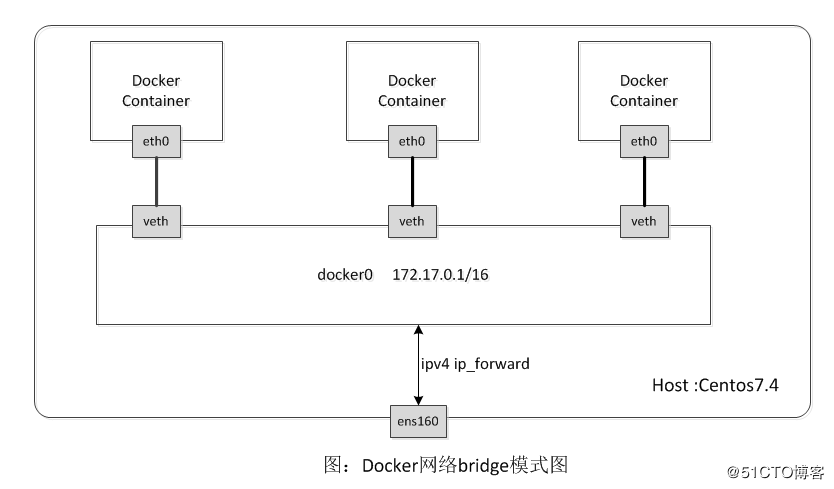

## 四、Docker网络

### 4.1、Docker的网络模式

​	Docker的网络实现利用了Linux上网络命名空间和虚拟网络设备（特别是veth pair）。熟悉这两部分的基本概念，可以有助于理解Docker网络的实现过程。

#### 4.1.1、基本原理

​	要实现网络通信，主机需要至少一个网络接口（物理接口或虚拟接口）与外界相通，并可以收发数据包；此外，如果不同子网之间要进行通信，需要额外的路由机制。

​	Docker中的网络接口默认都是虚拟的接口。虚拟接口的最大优势就是转发效率极高。这是因为Linxu通过在内核中进行数据复制来实现虚拟接口之间的数据转发，即发送接口的发送缓存中的数据包将被直接复制到接收接口的接收缓存中，而无需通过外部物理网络设备进行交换。对于本地系统和容器内系统来看，虚拟接口跟一个正常的以太网卡相比并无区别，只是它速度要快得多。

​	Docker容器网络就很好的利用了Linux虚拟网络技术。它在本地主机和容器内分别建立一个虚拟接口，并让它们彼此连通（这样的一对接口叫做veth pair）。



#### 4.1.2、网络创建过程

Docker创建一个容器的时候，会执行以下操作：

​	1、创建一对虚拟接口，分别放到本地主机和新容器的命名空间中。

​	2、本地主机一端的虚拟接口连接到默认的docker0网桥，并具有一个veth开头的唯一名字。

​	3、容器一端的虚拟接口将放到新创建容器中，并修改名字作为eth0。这个接口只在容器的命名空间中可见。

​	4、从网桥可用的地址段中获取一个空闲地址分配给容器的eth0，并配置默认路由网关为docker0网卡的内部接口docker0的IP地址。

​	5、此时，容器就可以使用它所能看到的eth0虚拟网卡来连接其他容器和访问外部网络了。

#### 4.1.3、常见Docker网络模型

- bridge

  通过veth接口来连接容器，*默认配置*。

- host

  不将容器网络放到隔离的命名空间中，即不要容器化容器内的网络。可以使用本地主机的网络，它拥有完全的本地主机接口访问权限。容器进程可以跟主机其他root进程一样打开低范围端口，可以访问本地网络服务（比如D-bus），还可以让容器做一些影响主机系统的事情，比如重启主机等。因此使用这个选项的时候要谨慎，如果进一步的使用--privileged=true参数，容器甚至会被允许直接配置主机的网络堆栈。

- container

  将新建的容器的进程放到一个已存在容器的网络栈中，新容器进程有自己的文件系统、进程列表、资源限制，但会和已存在的容器共享IP地址和端口等网络资源，两者进程可以直接通过lo环回接口通信。

- none

  将新建容器放到隔离的网络栈中，但是不进行网络配置。之后，用户可以自己进行配置。

#### 4.1.4、网络配置

​	用户使用--net=none后，Docker将不对容器网络进行配置，可以使用以下方式进行配置：

启用一个网络为none的容器

```
docker run -it --net=none alpine /bin/bash
```

查找容器进程id

```
docker inspect -f '{{.State.Pid}}' container_id
```

查看docker0网络信息

```
ip addr show docker0
```

创建一对”veth pair“接口A和B，绑定其中一个到docker0

```
ip link add A type veth peer name B
brctl addif docker0 A
ip link set A up
```

将B接口放到容器的网络命名空间，命名为eth0

```
ip link set B netns $PID
ip netns exec $PID ip link set dev B name eth0
ip netns exec $PID ip link set eth0 up
```

配置容器网络和网关

```
ip netns exec $PID ip addr add 172.17.1.2/24 dev eth0
ip netns exec $PID ip route add default via 172.17.1.1
```

以上就是Docker网络的配置过程。

当容器终止后，Docker会清空容器，容器内的网络接口会随网络命名空间一起被清除，A接口也被自动从docker0卸载并清除。

此外，在删除/var/run/netns/下的内容之前，用户可以使用ip netns exec 命令指定网络命名中进行配置，从而影响容器内的网络。


